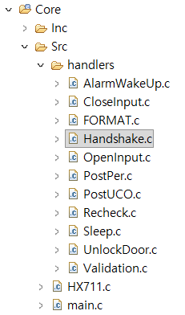

# 251212금__개선 사항

## Controller10 → Controller10.1

### 1. 프로젝트 버전 로깅

#### 개선 사항

프로젝트 버전 로깅 기능을 추가하였습니다.

프로젝트의 Setup 부분에 추가하였습니다.

***main.c***

```c
//Setup
	FUNCTION = SPACE;
	HAL_GPIO_WritePin(LED_GPIO_Port, LED_Pin, GPIO_PIN_SET); //Turn on led
	HAL_GPIO_WritePin(DEVICE_GPIO_Port, DEVICE_Pin, GPIO_PIN_SET);
	LOG("[DEBUG]", "STM32 OK!\n");
	LOG("[VER]", "Controller_v0.10.1\n");
...
    
```

#### 테스트

***log.txt***

```
10:23:40.514 [DEBUG]STM32 OK!
10:23:40.514 #[VER]Controller_v0.10.1
```

### 2. I2C HAL_BUSY로 인한 App 장애

#### 개선 사항

```c
LOG("[ANS]", "FAIL");
```

해당 로그로 인해 App에서 단계 진행이 안되었습니다.

때문에,

```c
LOG("[ANS]", "SYSTEM_FAIL");
```

로 로그를 수정하였고,

FAIL이 되어도 App의 단계 진행은 계속되도록 조치하였습니다.

또한 말씀하신 바와 같이 지금은 사용하지 않는 레이저 센서(VL53L0X)를 주석처리 하였습니다.

```c
	//TOF SENSOR
//	statInfo_t_VL53L0X distanceStr;
//	initVL53L0X(1, &hi2c1);
//	uint16_t offset_DistanceTof = VL53L0X_OFFSET(&distanceStr);
```

현재는 주석처리로만 마무리 하였지만 추후에는 하드웨어 계층을 나누어서 해당 계층에서 센서를 비활성화 시키겠습니다. 

#### App 테스트 

첫번째 테스트는 이상없이 동작하나


두번째 테스트부터 로드셀의 law data가 비정상적으로 출력됩니다. 모두 0 혹은 음수 값으로 출력됩니다.


#### 터미널 테스트

아래의 과정을 수십번 반복하였고 이상없이 I2C HAL은 동작합니다.

**Test Code**

***main.c***

```c
case HANDSHAKE:

    for (int repeat = 0; repeat < 100; repeat++) {
        memset(i2c_check_buf, 0, sizeof(i2c_check_buf));
        for (uint16_t addr = 1; addr < 128; addr++) {
            HAL_StatusTypeDef status = HAL_I2C_IsDeviceReady(&hi2c1,
                    addr << 1, 1, 5);
            // I2C HAL 상태가 HAL_OK라면 I2C 주소 출력
            if (status == HAL_OK) {
                snprintf(i2c_check_buf, sizeof(i2c_check_buf),
                        "I2C Device Found: 0x%02X\r\n", addr);
                LOG("[I2C]", i2c_check_buf);
                // I2C HAL 상태가 HAL_BUSY 상태라면
            } else if (status == HAL_BUSY) {
                LOG("[I2C]", i2c_check_buf);
                LOG("[I2C]", "HAL_BUSY\r\n");
                // 100번 루프 진행
                for (int i = 0; i < 10; i++) {
                    // I2C 비활성화
                    HAL_I2C_DeInit(&hi2c1);
                    // I2C1 하드웨어 강제 리셋
                    __HAL_RCC_I2C1_FORCE_RESET();
                    HAL_Delay(10);
                    LOG("[I2C]", "FORCE_RST_TRYING...\n");
                    // I2C1이 강제 리셋되었다면
                    if (RCC->APB1RSTR & RCC_APB1RSTR_I2C1RST) {
                        LOG("[I2C]", "I2C1_RESET_BIT_ON\n");
                        LOG("[I2C]", "RELEASE_RST_TRYING...\n");
                        // I2C1 리셋 해제
                        __HAL_RCC_I2C1_RELEASE_RESET();
                        // I2C1 리셋 해제가 되었다면
                        if ((RCC->APB1RSTR & RCC_APB1RSTR_I2C1RST)
                                == 0) {
                            LOG("[I2C]", "I2C1_RESET_BIT_OFF\n");
                            LOG("[I2C]", "I2C1_RESET_SUCCESS\n");
                            // HAL_I2C 활성화
                            HAL_I2C_Init(&hi2c1);
                            // 안정화 DELAY
                            HAL_Delay(10);
                            // HAL_I2C 초기화 후 상태가 HAL_OK가 아니라면
                            if (HAL_I2C_Init(&hi2c1) != HAL_OK) {
                                LOG("[I2C]", "HAL_INIT_FAIL\n");
                                continue; // 다음 루프 계속 진행
                            } else {
                                LOG("[I2C]", "HAL_INIT_OK\n");
                            }
                        }
                    } else {
                        LOG("[I2C1_RST]", "I2C1_RESET_FAIL\n");
                    }

                    status = HAL_I2C_IsDeviceReady(&hi2c1,
                            addr << 1, 1, 5);
                    // HAL_OK 시 break
                    if (status == HAL_OK) {
                        LOG("[I2C]", "HAL_RECOVERY_SUCCESS\n");
                        break;
                    }

                    if (i == 9) {
                        LOG("[I2C]", "HAL_RECOVERY_FAIL\n");
                    }
                }
            } else if (status == HAL_TIMEOUT) {
                LOG("[I2C]", "HAL_TIMEOUT\r\n");
                __HAL_RCC_I2C1_FORCE_RESET();
                HAL_Delay(10);
                if (RCC->APB1RSTR & RCC_APB1RSTR_I2C1RST) {
                    __HAL_RCC_I2C1_RELEASE_RESET();
                } else {
                    LOG("[I2C1_RST]", "I2C1_RESET_ERROR\n");
                }
                HAL_I2C_DeInit(&hi2c1);
                HAL_Delay(10);
                HAL_I2C_Init(&hi2c1);

                status = HAL_I2C_IsDeviceReady(&hi2c1, addr << 1, 1,
                        5);
            }
        }
    }

...
```

**Test Result**

***log.txt***

```
12:10:27.233 [DEBUG]STM32 OK!
12:10:27.233 #[VER]Controller_v0.10.1
12:10:27.236 #12:10:30.288 [CMD]HANDSHAKE
12:10:30.918 [ANS]ACK#[I2C]I2C Device Found: 0x29
12:10:30.921 #[I2C]I2C Device Found: 0x77
12:10:30.926 #[I2C]I2C Device Found: 0x29
12:10:30.936 #[I2C]I2C Device Found: 0x77
12:10:30.942 #[I2C]I2C Device Found: 0x29
12:10:30.952 #[I2C]I2C Device Found: 0x77
12:10:30.957 #[I2C]I2C Device Found: 0x29
12:10:30.967 #[I2C]I2C Device Found: 0x77
12:10:30.972 #[I2C]I2C Device Found: 0x29
12:10:30.981 #[I2C]I2C Device Found: 0x77
12:10:30.987 #[I2C]I2C Device Found: 0x29

...

12:10:32.412 #[ANS]SIM_OK
12:10:33.447 #[ANS]ULTRA_OK#[ANS]LC1_OK
12:10:33.459 #[ANS]LC2_OK
12:10:33.538 #[ANS]WS_OK

...
```

## Flutter 코드 분석

해당 프로젝트의 코드를 분석했습니다.

분석한 내용은 아래에 정리해두었습니다.

### 0. Overview

[0. Overview](./assets/files/FlutterCodeAnalysis/0.%20Overview/0.%20Overview.pdf)

### 1. Architecture

[1. Architecture](./assets/files/FlutterCodeAnalysis/1.%20Architecture/1.%20Architecture.pdf)

### 2. EntryPoint & Configuration

[config.dart](./assets/files/FlutterCodeAnalysis/2.%20EntryPoint/config.dart.pdf)

[main.dart](./assets/files/FlutterCodeAnalysis/2.%20EntryPoint/main.dart.pdf)

[router.dart](./assets/files/FlutterCodeAnalysis/2.%20EntryPoint/router.dart.pdf)

[router.g.dart](./assets/files/FlutterCodeAnalysis/2.%20EntryPoint/router.g.dart.pdf)

### 3. Presentation(UI)

#### **screen**

[s_driver.dart](./assets/files/FlutterCodeAnalysis/3.%20Presentation(UI)/screen/s_driver.dart.pdf)

[s_opening_door.dart](.)

[s_setting.dart](./assets/files/FlutterCodeAnalysis/3.%20Presentation(UI)/screen/s_setting.dart.pdf)

[s_splash.dart](./assets/files/FlutterCodeAnalysis/3.%20Presentation(UI)/screen/s_splash.dart.pdf)

[s_step1.dart](./assets/files/FlutterCodeAnalysis/3.%20Presentation(UI)/screen/s_step1.dart.pdf)

[s_step2.dart](./assets/files/FlutterCodeAnalysis/3.%20Presentation(UI)/screen/s_step2.dart.pdf)

[s_step3.dart](./assets/files/FlutterCodeAnalysis/3.%20Presentation(UI)/screen/s_step3.dart.pdf)

[s_step4.dart](./assets/files/FlutterCodeAnalysis/3.%20Presentation(UI)/screen/s_step4.dart.pdf)

#### widget

[box_setting.dart](./assets/files/FlutterCodeAnalysis/3.%20Presentation(UI)/widget/step1/box_setting.dart.pdf)

[btn_home.dart](./assets/files/FlutterCodeAnalysis/3.%20Presentation(UI)/widget/step1/btn_home.dart.pdf)

[btn_number.dart](./assets/files/FlutterCodeAnalysis/3.%20Presentation(UI)/widget/step1/btn_number.dart.pdf)

[btn_setting.dart](./assets/files/FlutterCodeAnalysis/3.%20Presentation(UI)/widget/step1/btn_setting.dart.pdf)

[btn_to_connect_port.dart](./assets/files/FlutterCodeAnalysis/3.%20Presentation(UI)/widget/step1/btn_to_connect_port.dart.pdf)

[btn_to_setting.dart](./assets/files/FlutterCodeAnalysis/3.%20Presentation(UI)/widget/step1/btn_to_setting.dart.pdf)

[circular_prograss.dart](./assets/files/FlutterCodeAnalysis/3.%20Presentation(UI)/widget/step1/circular_prograss.dart.pdf)

[debug_buttons.dart](./assets/files/FlutterCodeAnalysis/3.%20Presentation(UI)/widget/step1/debug_buttons.dart.pdf)

[w_header.dart](./assets/files/FlutterCodeAnalysis/3.%20Presentation(UI)/widget/step1/w_header.dart.pdf)

[w_left_triangle.dart](./assets/files/FlutterCodeAnalysis/3.%20Presentation(UI)/widget/step1/w_left_triangle.dart.pdf)

[w_step_nev.dart](./assets/files/FlutterCodeAnalysis/3.%20Presentation(UI)/widget/step1/w_step_nev.dart.pdf)

### 4. ViewModel

[vm_driver.dart](./assets/files/FlutterCodeAnalysis/4.%20ViewModel/vm_driver.dart.pdf)

[vm_serial_port.dart](./assets/files/FlutterCodeAnalysis/4.%20ViewModel/vm_serial_port.pdf)

[vm_setting.dart](./assets/files/FlutterCodeAnalysis/4.%20ViewModel/vm_setting.dart.pdf)

[vm_step1.dart](./assets/files/FlutterCodeAnalysis/4.%20ViewModel/vm_step1.dart.pdf)

[vm_step2.dart](./assets/files/FlutterCodeAnalysis/4.%20ViewModel/vm_step2.dart.pdf)

[vm_step3.dart](./assets/files/FlutterCodeAnalysis/4.%20ViewModel/vm_step3.dart.pdf)

[vm_step4.dart](./assets/files/FlutterCodeAnalysis/4.%20ViewModel/vm_step4.dart.pdf)

### 5. Model

[ui_state_setting.dart](./assets/files/FlutterCodeAnalysis/5.%20Model/ui_state_setting.dart.pdf)

[ui_state_step1](./assets/files/FlutterCodeAnalysis/5.%20Model/ui_state_step1.dart.pdf)

[ui_state_step2](./assets/files/FlutterCodeAnalysis/5.%20Model/ui_state_step2.dart.pdf)

[ui_state_step3](./assets/files/FlutterCodeAnalysis/5.%20Model/ui_state_step3.dart.pdf)

[ui_state_step4](./assets/files/FlutterCodeAnalysis/5.%20Model/ui_state_step4.dart.pdf)

[ui_state_usb_port](./assets/files/FlutterCodeAnalysis/5.%20Model/ui_state_usb_port.dart.pdf)

### 6. Common

[app_commands.dart](./assets/files/FlutterCodeAnalysis/6.%20Common/app_commands.dart.pdf)

[app_strings.dart](./assets/files/FlutterCodeAnalysis/6.%20Common/app_strings.dart.pdf)

[custom_toast.dart](./assets/files/FlutterCodeAnalysis/6.%20Common/utils/custom_toast.dart.pdf)

[show_toast.dart](./assets/files/FlutterCodeAnalysis/6.%20Common/utils/show_toast.dart.pdf)

[toast_provider.dart](./assets/files/FlutterCodeAnalysis/6.%20Common/utils/toast_provider.dart.pdf)

[toast_state.dart](./assets/files/FlutterCodeAnalysis/6.%20Common/utils/toast_state.dart.pdf)

# 차후 계획 및 진행 사항

## STM32 H/W 및 F/W

### 0. 오류 개선

1. 비정상 센서 출력 오류 해결

### 1. 코드 간소화

#### 개선 사항

아래와 같이 case마다 모듈화 및 함수 단일화를 진행하고 있습니다.

***main.c***

```c
...
    
switch (FUNCTION) {
			case HANDSHAKE:
				Handshake();
				break;

			case VALIDATION:
				Validation();
				break;

			case POST_UCO:
				PostUCO();
			    break;

			case POST_PER:
				PostPeriodic();
				break;

			case OPEN_INPUT:
				DoorOpen_Measure();
				break;

			case CLOSE_INPUT:
				DoorClose_Measure();
				break;

			case RECHECK:
				Recheck();
				break;

			case UNLOCK_DOOR:
				UnlockDoor();
				break;

			case SLEEP:
				SleepMode();
				break;

			case ALARM_WAKEUP:
				AlarmWakeUpMode();
				break;
        
...
```

#### 테스트

현재는 변수 중복선언에 의한 에러가 빈번히 발생해서 개선중에 있습니다.

### 4. 파일 트리 개선

#### 개선 사항

아래와 같이 switch-case 문의 상태에 따른 동작들을 handlers 디렉터리에 정리하였습니다.

추후에는 프로젝트의

* 하드웨어 드라이버 모듈
* 하드웨어 점검 및 초기화 모듈
  * 하드웨어 리셋
  * 펌웨어 레지스터
* 에러 및 예외 처리 모듈
* 로그 출력 모듈
* 더미 데이터 출력 모듈
* 기능 테스트 모듈
* 통합 테스트 모듈

등으로 디렉터리를 구조화 및 정돈할 예정입니다.



#### 테스트

현재는 변수 중복선언에 의한 에러가 빈번히 발생해서 개선중에 있습니다.

### Git/GitHub를 통한 App 빌드 업무 개선

#### 개선 사항

Flutter App 설치를 위한 GitHub 리포지토리를 생성하였고 App 설치 과정을 조금 더 편리하게 하였습니다.

추수에는 CI/CD를 통해 Git Push 만으로 App 빌드가 되도록 개선하겠습니다.

#### 테스트

미진행 상태입니다.